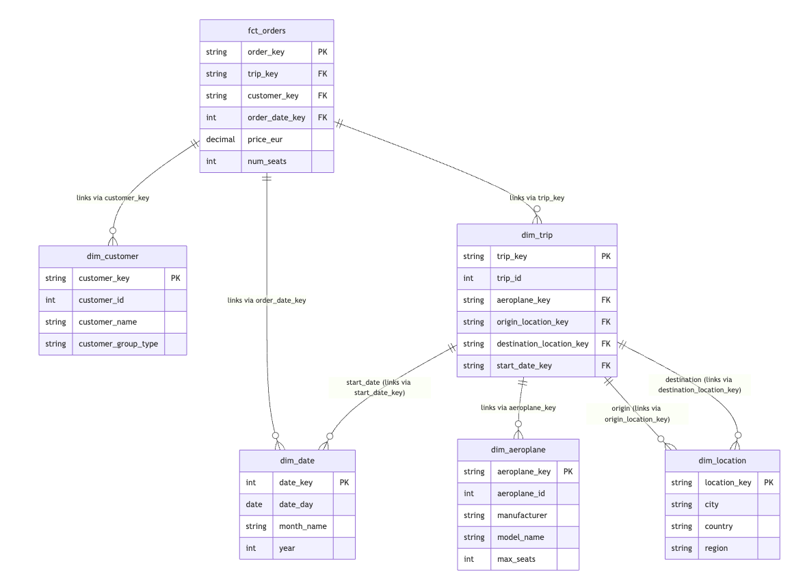

# Air Boltic 

This repository contains the dbt transformation layer for the Air Boltic analytics platform. It is designed to be reliable, scalable, and maintainable, built on a modern Lakehouse architecture.

## Core Architecture: The Modern Lakehouse (_My Assumptions_)

* This project is built on a Lakehouse architecture, which separates storage from compute. This is the key to scalability.
    * S3 as the "Database": All data, from raw (JSON/CSV) to transformed (fct_orders), is stored in S3.
    * Delta Lake as the "Format": This gives our S3 files "database" superpowers like ACID transactions, schema enforcement, and time travel. It makes our data reliable.
    * Databricks as the "Engine": Databricks provides the compute (SQL Warehouse) to process the data. It reads data from S3, transforms it in memory, and writes it back to S3 as new Delta tables.
    * DBT as the data transformation Tool: dbt connects to the Databricks engine and runs all our SQL transformation logic in the correct order.
    * DBT Cloud (_my best guess_)/Databricks Worksflows/Airflow as orchestration tool: responsible for scheduling the jobs on regular basis.
    * Looker as the "Explorer" (_can be ignroed for the readme file_): Looker connects directly to the Databricks SQL Warehouse to query the final tables, providing self-service analytics to the business.

## Data Model

The project follows a **Star Schema** design, which is the industry standard for analytics and BI.
The model consists of:
* **Facts (`marts`):** A central fact table (`fct_orders`) containing our key metrics (price, seats) and foreign keys.
* **Dimensions (`marts`):** Descriptive dimension tables (`dim_customer`, `dim_trip`, `dim_aeroplane`, `dim_location`, `dim_date`) that provide the "who, what, where, when" context for analysis.
This design is simple, scalable, and makes self-service analytics easy for end-users.

### Entity Relationship Diagram (ERD)




# Environment Setup(One-Time)

* Before dbt can select from the raw data, we must add our raw S3 files as tables in the Databricks Unity Catalog. This is a one-time setup run directly in Databricks. Here is an example for the customer table. _This same pattern would be repeated for all raw sources_.
``` sql 
-- 1. Create the schema (database) to hold our raw tables
CREATE SCHEMA IF NOT EXISTS raw_catalog.raw_air_boltic
COMMENT 'Schema for raw Air Boltic data from S3';

-- 2. Create the table, pointing it to the S3 path
CREATE TABLE IF NOT EXISTS raw_catalog.raw_air_boltic.customer
(
  `Customer ID` INT,
  `Name` STRING,
  `Customer Group ID` INT,
  `Email` STRING,
  `Phone Number` STRING,
  `_loaded_at` TIMESTAMP
)
USING CSV -- Or JSON, PARQUET, etc.
OPTIONS (
  path = "s3://air-boltic-data/raw/customer/",
  header = "true"
);

```

## Key Assumptions & Design Decisions

This model is built on several key assumptions:
* **Incremental Ingestion**: I assume a data ingestion service (like Fivetran, Airbyte, or any 'custom script') is continuously loading raw data into the S3 layer.
* **_loaded_at Timestamp: This is critical**: I assumed all source tables have a _loaded_at (or _synced_at) column added during ingestion. This column is non-negotiable for a scalable platform, as it enables:
    * Data freshness checks (e.g., "Have we received orders data in the last hour?").
    * Efficient incremental processing (e.g., dbt run --select state:modified+).
* **Unity Catalog**: (_searched on languague models existing avaialable options & trade offs_ ) The solution is designed for a Databricks Unity Catalog setup. I assume source data is located in a central raw_catalog (or similar), which dbt's source().yml function points to. Dev and prod environments write to separate catalogs (bolt_dev_catalog, bolt_prod_catalog) for complete isolation.
* **Surrogate Keys**: All mart dimension tables (e.g., dim_customer) use a surrogate key (e.g., customer_key) as their primary key. This is a core data warehousing practice that improve performance and gurantees uniqueness especially for large scale data.
* **Data Enrichment**: I assume we would need dim_location and dim_date. dim_location can be created by using an external dataset (e.g., Geonames, a public API) to enrich our city names with country, region, and continent for geographical analysis.
* **Static Seeds**: The aeroplane_model.json is treated as static reference data. It has been converted to a CSV and placed in the /seeds directory to be loaded via dbt seed.

# Data Quality Strategy

* **Source Tests**: Test raw data before transformation.

    * **Freshness**: Ensures data is up-to-date using dbt source freshness on the **_loaded_at** column.
    * **Volume**: Checks for anomalies (e.g., row count suddenly dropping to 0) using dbt-expectations.
* **Staging & Mart Tests**: We apply generic tests (not_null, unique, relationships) to all models.
    * **High-Frequency (Incremental)**: On every run, we use custom incremental tests (e.g., incremental_unique) to validate new data quickly and cost-effectively.
    * **Full-Scan (Weekly)**: On a weekly schedule (e.g., Sunday), a separate job runs the full-scan tests on all data to catch any historical issues.
* **Alerting/Monitoring**: Assuming the orchestration tool (dbt Cloud, Airflow etc) is configured to monitor test failures. A failed dbt test run will trigger an alert (e.g., via Slack or email) to notify the data team.

## Quickstart
* Set local environment variables (see below).
    * cd dbt (or your dbt project root)
    * dbt seed (Loads the aeroplane_models.csv file)
    * dbt run (Builds all models)
    * dbt test (Runs all data quality tests)
    * dbt docs generate && dbt docs serve (View the project documentation)

`Env Vars` (example)
These must be set in your local or CI/CD environment to match the profiles.yml configuration.

export DATABRICKS_HOST="https://<your>.cloud.databricks.com"
export DATABRICKS_HTTP_PATH="/sql/1.0/warehouses/<id>"
export DATABRICKS_TOKEN="<pat>"

## Structure

```
AIR-BOLTIC-ANALYTICS/
├─ .github/workflows/       # CI/CD workflows
├─ assets/
│  └─ air_boltic_data_model_ERD.png  # ERD image for README
│
├─ dbt/                       # The dbt project folder
│  ├─ analysis/
│  ├─ macros/
│  │  ├─ is_timestamp.sql
│  │  └─ surrogate_key.sql
│  │
│  ├─ models/
│  │  ├─ staging/           # 1:1 cleaned sources
│  │  │  ├─ sources.yml
│  │  │  └─ ...
│  │  │
│  │  ├─ dimensions/        # Dimension models (dim_customer, etc.)
│  │  │  └─ ...
│  │  │
│  │  ├─ facts/             # Fact models (fct_orders, etc.)
│  │  │  └─ ...
│  │  │
│  │  └─ shared/            # Reusable models (e.g., dim_date)
│  │     └─ ...
│  │
│  ├─ seeds/
│  │  └─ aeroplane_model.csv
│  │
│  ├─ tests/                 # Custom singular tests
│  │
│  ├─ dbt_project.yml        # dbt project configuration
│  ├─ packages.yml           # dbt package dependencies
│  └─ profile.yml            # (Should be in .gitignore)
│
├─ .gitignore
└─ README.md

```
--------------------------------------------------------------------------------------------------------------------------------
## Answering the Business Questions

This data model is designed to directly answer the key questions from the case study in a self-service BI tool like Looker. Analysts can find answers by combining metrics from `fct_orders` with the pre-built categories in the dimensions.

* **To Find "Drivers of Growth" (e.g., Revenue):**
    * **Metric:** `SUM(price_eur)` from `fct_orders`.
    * **Dimensions:** Group by `dim_location.country`, `dim_aeroplane.plane_size_category`, or `dim_customer.customer_type`.

* **To Find "Kind of Customers We Serve Well":**
    * **Metric:** `SUM(price_eur)` or `COUNT(DISTINCT customer_key)`.
    * **Dimension:** `customer_type` from `dim_customer` (e.g., 'Company', 'Individual').

* **To Find "Kind of Use Cases We Cover":**
    * **Short vs. Long?** Group by `trip_distance_category` from `dim_trip`.
    * **Low Cost vs. Premium?** Group by `price_category` from `fct_orders`.
    * **Small vs. Big Planes?** Group by `plane_size_category` from `dim_aeroplane`.

* **To Monitor Daily/Monthly Active Users (DAU/MAU):**
    * **Metric:** `COUNT(DISTINCT customer_key)` from `fct_orders`.
    * **Time Dimension:** Group by `dim_date.date_day` (for DAU) or `dim_date.month` (for MAU).
    * **Caveat:** This currently tracks *Transacting Active Users* and relies on a proxied `order_date`.